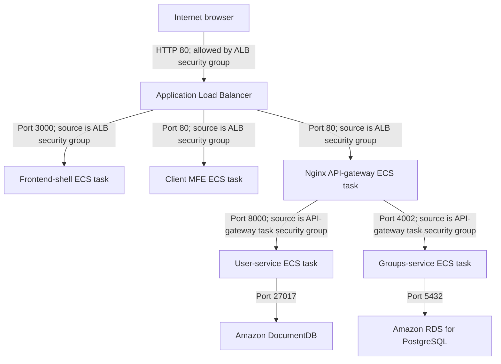

# Divided By All — AWS Deployment Runbook

This is the practical, step-by-step record for deploying Divided By All to AWS. It is written for
learning: each step explains what is created, why it exists, what to choose in the AWS Console,
and how it connects to the overall architecture.

Do not place passwords, AWS keys, database URLs, or other secrets in this file.

## Naming convention

This runbook introduces AWS services with their full name and abbreviation, then uses the
abbreviation for the rest of the step.

```text
Amazon Elastic Container Registry (ECR)
Amazon Elastic Container Service (ECS)
Amazon Elastic Compute Cloud (Amazon EC2)
Application Load Balancer (ALB)
Auto Scaling group (ASG)
```

## Deployment goal

Deploy the current application to AWS in Mumbai (`ap-south-1`):

```text
Internet
  |
Application Load Balancer (ALB)
  |
  +--> Frontend shell ECS service
  +--> Client MFE ECS service
  `--> Nginx API-gateway ECS service
         +--> User ECS service --> DocumentDB
         `--> Groups ECS service --> RDS PostgreSQL

ECS tasks run on EC2 instances supplied and scaled by an Auto Scaling Group (ASG).
```

This first deployment intentionally excludes Route 53, CloudFront, WAF, Kafka/MSK, Expense, and
Notification. Those are later phases after the current services work through the
ALB.

## Core concepts used in this deployment

### Docker image and container

A Docker **image** is a packaged application blueprint: application code, runtime, dependencies,
and startup command. A running copy of that blueprint is a Docker **container**. In ECS, a running
container is usually called a **task**.

```text
Docker image in ECR -> ECS task definition -> running ECS task/container
```

### IAM role, trust policy, and permission policy

An IAM role is a temporary AWS identity, similar to a temporary employee badge.

```text
Role             = the temporary badge/identity
Trust policy     = who is allowed to use that badge
Permission policy = which AWS actions and resources the badge can access
```

For this deployment, GitHub Actions assumes a role only while a workflow runs. AWS then issues
temporary credentials that automatically expire.

### ARN

An Amazon Resource Name (ARN) is AWS's full unique address for a resource. For example:

```text
arn:aws:ecr:ap-south-1:389656351866:repository/divided-by-all/user-service
```

It identifies the ECR service, Mumbai region, AWS account, and one exact repository. Adding a
repository ARN to a policy restricts access to that exact repository rather than every ECR
repository in the account.

### Security group story: labels attached to resources

A security group is not a server and does not send requests. It is a firewall label attached to a
resource's network interface. Each inbound rule says which callers are allowed to reach the
resource on a particular port.

```text
1. divided-by-all-alb-sg is attached to the Application Load Balancer (ALB).
   Rule: anyone on the internet may reach the ALB on port 80.

2. divided-by-all-frontend-tasks-sg is attached later to frontend ECS tasks.
   Rule: only a caller wearing divided-by-all-alb-sg may reach port 3000.

3. divided-by-all-api-gateway-tasks-sg is attached later to Nginx API-gateway ECS tasks.
   Rule: only a caller wearing divided-by-all-alb-sg may reach port 80.

4. divided-by-all-user-service-tasks-sg is attached later to User-service ECS tasks.
   Rule: only a caller wearing divided-by-all-api-gateway-tasks-sg may reach port 8000.
```

For example, the ALB receives a browser request and opens a new connection to the frontend task.
AWS sees that this new connection originates from the ALB network interface, which has
`divided-by-all-alb-sg` attached. It therefore allows the frontend-task rule. The browser never
connects directly to the frontend task.

## Current status

| Step | Status | Notes |
|---|---|---|
| AWS budget | Complete | Budget cap set to no more than ₹5,000/month. |
| ECR repositories | Complete | Five private repositories were created in `ap-south-1`. |
| GitHub OIDC provider | Complete | GitHub Actions is registered as a trusted identity source. |
| GitHub OIDC IAM roles | Complete | Separate backend and frontend roles trust only their own `main`-branch workflow. |
| ECR push permissions | In progress | Next step; attach least-privilege policies to the two GitHub roles. |
| GitHub → ECR pipeline | First job successful | GitHub OIDC, role assumption, Docker build, and ECR push have been verified; confirm images in ECR and run the other repository workflow if needed. |
| VPC, ALB, ECS, ASG | Core infrastructure complete | One ASG-managed EC2 instance is running and registered with the ECS cluster. |
| ECS task security groups | In progress | Create service-level firewalls before task definitions and ECS services. |
| RDS, DocumentDB, Secrets Manager | RDS database in progress | RDS private-subnet placement is complete; create the Groups PostgreSQL database next. |
| ECS services | Not started | Frontend, Client MFE, gateway, User, Groups. |

## Architecture progress map

### Created so far

```text
GitHub Actions
  -> OIDC identity provider + repository-specific IAM roles
  -> ECR
       |- user-service image repository
       |- groups-service image repository
       |- api-gateway image repository
       |- frontend-shell image repository
       `- client-mfe image repository

VPC: divided-by-all-vpc (two AZs)
  |- two public subnets
  |    `- internet-facing ALB: divided-by-all-alb
  |          `- frontend target group (currently empty)
  `- two private subnets
```

The target group is intentionally empty because the frontend ECS service does not exist yet. An
ALB can be created before its destination containers; after the ECS service starts, ECS registers
the task IP addresses and the ALB begins forwarding requests.

### Remaining first-deployment architecture

```text
Browser
  |
  v
ALB
  |- /             -> frontend-shell ECS service
  |- /mfe/*        -> client-mfe ECS service
  `- /auth/*, /profiles/*, /groups/* -> api-gateway ECS service
                                           |
                                           `-> ECS Service Connect
                                               |- user-service -> DocumentDB
                                               `- groups-service -> RDS PostgreSQL

ECS services/tasks
  |
  v
ECS Capacity Provider
  |
  v
ASG
  |
  `-> EC2 instances that supply CPU and memory for ECS tasks
```

Later phases add Route 53, CloudFront, WAF, HTTPS, Expense, Notification, and Kafka on
Amazon MSK.

## Remaining path to the first working AWS application URL

The following items remain before the full current application can work through the ALB DNS name.
They are implementation steps, not new architecture decisions.

1. Finish the Groups PostgreSQL database in Amazon RDS.
2. Create an Amazon DocumentDB subnet group and DocumentDB cluster for User service, then store
   connection details in AWS Secrets Manager.
3. Create ECS task execution and application task IAM roles so tasks can pull images from Amazon
   ECR, write logs, and later read their required secrets.
4. Create target groups and ALB listener rules for Client MFE and Nginx API gateway.
5. Create five ECS task definitions: frontend shell, Client MFE, API gateway, User service, and
   Groups service.
6. Create the five ECS services, attach security groups, attach target groups where public, and
   configure ECS Service Connect for internal User/Groups calls.
7. Configure runtime values: database URLs, JWT secret, frontend API URL, and Client MFE URL.
8. Allow the Groups-service Prisma migration to run against RDS; configure User service for the
   DocumentDB connection; then test the ALB DNS URL.

Before deploying all five services, verify Amazon EC2 capacity. One `t3.micro` has limited memory;
the ASG can add a second instance, but we may need to adjust task memory reservations or move to a
larger instance type if ECS cannot place every task.

## Local Compose preflight versus AWS ECS

Local Docker Compose is the preflight environment; AWS ECS does not run these Compose files.
Start each backend service from its own directory so its database dependency and local runtime
configuration are supplied by that service's Compose file:

```bash
cd User
docker compose up --build -d

cd ../groups-service
docker compose up --build -d

cd ../expense-service
docker compose up --build -d
```

The local application containers use these stable names on `devtinder-net`: `user-service`,
`group-service`, and `expense-service`. The local User MongoDB image is
`divided-by-all/user-service-mongo-db`; the local Groups and Expense PostgreSQL images are
`divided-by-all/groups-service-postgress-db` and
`divided-by-all/expense-service-postgress-db`. Docker container names cannot contain `/`, so their
container names use hyphens instead. Local database credentials in Compose are development-only
values. Do not copy them into an ECS task definition.

For AWS, put the equivalent runtime configuration in each ECS task definition. Non-secret values
belong under `environment`; database connection strings and `JWT_SECRET` belong in AWS Secrets
Manager and are injected through the task definition's `secrets` section:

| Service | Local Compose value | AWS ECS source |
|---|---|---|
| User | `MONGO_URL`, `JWT_SECRET`, Redis host/port | Secrets Manager for Mongo/JWT; ECS service discovery or managed endpoint for Redis |
| Groups | `DATABASE_URL` | Secrets Manager URL for the Groups RDS database |
| Expense (later phase) | `DATABASE_URL` | Secrets Manager URL for the Expense RDS database |

Compose `container_name` values do not provide AWS service discovery. ECS task containers receive
their names from task definitions, and private service addresses come from ECS Service Connect.
Expense remains outside the first AWS deployment, as stated in this runbook; add its ECR
repository, RDS database, secret, task definition, security group, Service Connect entry, and ECS
service together when the Expense phase begins.

## Step 1 — Amazon ECR repositories

**Official AWS documentation:** [Create an Amazon ECR private repository](https://docs.aws.amazon.com/AmazonECR/latest/userguide/repository-create.html)

### What ECR is

Amazon Elastic Container Registry (ECR) is AWS's private storage service for Docker images.

```text
Docker image = packaged application blueprint
Docker container/ECS task = a running copy of that image
```

GitHub Actions will build each service image, push it to ECR, and ECS will pull that exact image
when it deploys a task.

### Repositories created

```text
divided-by-all/user-service
divided-by-all/groups-service
divided-by-all/api-gateway
divided-by-all/frontend-shell
divided-by-all/client-mfe
```

### Settings selected

- **Private:** images are not publicly downloadable.
- **Tag immutability:** an existing tag cannot be silently replaced with different image content.
  GitHub will use an immutable Git commit SHA such as `85fb076` as a tag.
- **Basic scan on push:** ECR checks pushed images for known vulnerabilities.
- **AES-256 encryption:** AWS encrypts stored images at rest using the default managed key.

### Why tag immutability matters

Without immutability, `user-service:latest` might point to code version A today and code version B
tomorrow. With an immutable commit tag, the deployed code is always traceable and rollback is
possible by selecting a previous known-good tag.

## Step 2 — GitHub OIDC identity provider (in progress)

**Official AWS documentation:** [Create an OpenID Connect identity provider in IAM](https://docs.aws.amazon.com/IAM/latest/UserGuide/id_roles_providers_create_oidc.html)

### What is being created

An OpenID Connect (OIDC) identity provider for GitHub Actions in IAM.

This tells AWS that GitHub Actions can prove the identity of a workflow run. It grants no AWS
permissions by itself; the restricted IAM role created in the next step grants those permissions.

### Why use OIDC

OIDC avoids storing long-lived AWS access keys in GitHub.

```text
GitHub Actions workflow starts
  |
GitHub proves its repository and workflow identity to AWS
  |
AWS issues short-lived credentials for one workflow run
  |
Workflow pushes an image to ECR
  |
Credentials expire automatically
```

The identity provider alone grants no AWS permission. It simply lets AWS verify claims GitHub
provides, such as the repository and branch that started a workflow.

### AWS Console instructions

1. In the AWS Console, open **IAM**.
2. Select **Identity providers** in the left navigation.
3. Select **Add provider**.
4. Set provider type to **OpenID Connect**.
5. Enter:

   ```text
   Provider URL: https://token.actions.githubusercontent.com
   Audience:     sts.amazonaws.com
   ```

6. Select **Add provider**.

`sts.amazonaws.com` is AWS Security Token Service, the AWS service that issues temporary
credentials. If this provider already exists, do not create a duplicate; proceed to the IAM-role
step instead.

## Step 3 — Restricted GitHub Actions IAM roles (in progress)

**Official AWS documentation:** [Create a role for OpenID Connect federation](https://docs.aws.amazon.com/IAM/latest/UserGuide/id_roles_create_for-idp_oidc.html)

### What is being created

Two IAM roles, created through the IAM Web identity wizard:

```text
GitHubActionsMicroservicesEcrRole
GitHubActionsFrontendEcrRole
```

An IAM role is a set of AWS permissions that a trusted identity can temporarily assume. The OIDC
provider answers “is this GitHub?”; these roles answer “which GitHub workflows may receive which
AWS permissions?”. The roles have no permissions until we attach ECR policies in the following
step.

The two roles are intentionally separate:

```text
GitHubActionsMicroservicesEcrRole
  -> trusted only by the backend repository's main branch
  -> later allowed to push only backend images

GitHubActionsFrontendEcrRole
  -> trusted only by the frontend repository's main branch
  -> later allowed to push only frontend images
```

This separation means a backend workflow cannot automatically push a frontend image, and a
frontend workflow cannot automatically push a backend image.

### AWS Console instructions

Create the first role now:

1. In **IAM**, select **Roles** and then **Create role**.
2. Select **Web identity**.
3. For **Identity provider**, choose `token.actions.githubusercontent.com` (GitHub).
4. For **Audience**, choose `sts.amazonaws.com`.
5. Under GitHub organization, enter `Rishitosh0112`.
6. Under Repository, choose `divided_by_all_microservices`.
7. Under GitHub branch, choose `main`.
8. Select **Next**. Do not attach permissions yet; we will create a least-privilege ECR policy in
   the next step.
9. Name the role `GitHubActionsMicroservicesEcrRole` and select **Create role**.

Repeat the same wizard after that for the frontend repository, changing only these values:

```text
Repository: divided_by_all_ssr_microfrontend
Role name:  GitHubActionsFrontendEcrRole
```

The wizard creates the trust restrictions for the selected repository and branch. A workflow from
another repository, or from a branch other than `main`, cannot assume either role.

## Step 4 — Least-privilege ECR push policies (in progress)

**Official AWS documentation:** [Amazon ECR private repository permissions](https://docs.aws.amazon.com/AmazonECR/latest/userguide/repository-policies.html)

### What is being created

Two IAM permission policies. A trust policy answers **who may become a role**; a permission policy
answers **what that role may do after it is assumed**.

The ECR policies are not application code. They are AWS security rules attached to the roles.
They allow a GitHub workflow to upload a Docker image, but do not grant it permission to create
EC2 instances, deploy ECS services, access databases, or access unrelated ECR repositories.

The backend policy is attached only to `GitHubActionsMicroservicesEcrRole` and is limited to:

```text
divided-by-all/user-service
divided-by-all/groups-service
divided-by-all/api-gateway
```

### Backend policy — AWS Console instructions

1. In **IAM**, open **Policies** and select **Create policy**.
2. Use the **Visual** editor and select **Add new statement**.
3. Choose service **Elastic Container Registry**.
4. Under actions, select only `GetAuthorizationToken`.
5. This action must use **All resources**. It only obtains a temporary Docker login token and does
   not itself allow image reads or writes.
6. Add a second statement. Choose **Elastic Container Registry** again and select only these five
   actions:

   ```text
   BatchCheckLayerAvailability
   CompleteLayerUpload
   InitiateLayerUpload
   PutImage
   UploadLayerPart
   ```

7. For the second statement, choose **Specific** resources and add these ECR repository ARNs:

   ```text
   arn:aws:ecr:ap-south-1:389656351866:repository/divided-by-all/user-service
   arn:aws:ecr:ap-south-1:389656351866:repository/divided-by-all/groups-service
   arn:aws:ecr:ap-south-1:389656351866:repository/divided-by-all/api-gateway
   ```

8. Review the policy and name it `GitHubActionsMicroservicesEcrPushPolicy`.
9. Create it, then open `GitHubActionsMicroservicesEcrRole` → **Permissions** → **Add
   permissions** → **Attach policies**, find this policy, and attach it.

We will repeat the same idea for the frontend role, but only for its two frontend ECR repositories.

### What the ECR actions mean

A Docker image consists of layers, such as a Node.js base layer, dependency layer, and application
code layer. GitHub needs the following permission sequence to push those layers:

```text
GetAuthorizationToken
  -> obtains a short-lived Docker login token for ECR

BatchCheckLayerAvailability
  -> checks whether ECR already stores a layer

InitiateLayerUpload
  -> starts uploading a missing layer

UploadLayerPart
  -> sends pieces of that layer

CompleteLayerUpload
  -> finishes the layer upload

PutImage
  -> creates the final image manifest and tag, for example :85fb076
```

`GetAuthorizationToken` must use `All resources` because the token is an account-level login
operation. The other actions are restricted to specific repository ARNs, which is what prevents
the backend role from pushing to frontend repositories and vice versa.

### Frontend policy — AWS Console instructions

Create a second policy through the same visual-editor process:

- Policy name: `GitHubActionsFrontendEcrPushPolicy`
- First statement: `GetAuthorizationToken` with **All resources**.
- Second statement actions:

  ```text
  BatchCheckLayerAvailability
  CompleteLayerUpload
  InitiateLayerUpload
  PutImage
  UploadLayerPart
  ```

- Second statement resources:

  ```text
  arn:aws:ecr:ap-south-1:389656351866:repository/divided-by-all/frontend-shell
  arn:aws:ecr:ap-south-1:389656351866:repository/divided-by-all/client-mfe
  ```

Attach this policy only to `GitHubActionsFrontendEcrRole`.

## Step 5 — GitHub Actions builds and pushes images (updated locally)

**Official AWS documentation:** [Private registry authentication in Amazon ECR](https://docs.aws.amazon.com/AmazonECR/latest/userguide/registry_auth.html)

### What changed

The previous workflows used long-lived AWS access-key secrets, pushed mutable `latest` tags to
old repository names, then copied Docker Compose files to an EC2 server over SSH. That is the
old EC2-host deployment model and does not fit the ECS deployment we are building.

Both workflows now do this instead:

```text
push to main (or manual workflow run)
  -> GitHub checks out source code
  -> GitHub uses OIDC to assume its repository-specific IAM role
  -> GitHub receives temporary AWS credentials
  -> GitHub logs in to ECR
  -> GitHub builds Docker images
  -> GitHub tags every image with the exact Git commit SHA
  -> GitHub pushes images to the matching ECR repositories
```

The backend workflow pushes to:

```text
divided-by-all/user-service
divided-by-all/groups-service
divided-by-all/api-gateway
```

The frontend workflow pushes to:

```text
divided-by-all/frontend-shell
divided-by-all/client-mfe
```

There is intentionally no SSH, Docker Compose, EC2 login, or ECS deployment step yet. The next
infrastructure phase creates ECS before GitHub can deploy tasks there.

### Why use the Git commit SHA as the image tag

For a commit such as `85fb076`, GitHub pushes an image reference similar to:

```text
389656351866.dkr.ecr.ap-south-1.amazonaws.com/divided-by-all/user-service:85fb076
```

The tag identifies one exact version of source code. This works with ECR tag immutability and
makes a later ECS deployment and rollback explicit. We intentionally do not push a mutable
`latest` tag.

### Client MFE build variable

The frontend-shell image receives `NEXT_PUBLIC_MFE_REMOTE_URL` from the GitHub repository variable
`MFE_REMOTE_URL`. This value is compiled into the Next.js browser build. Leave it unset while the
ALB/MFE public URL does not exist; before the frontend is deployed, create the ALB route, set the
GitHub variable to the final Client MFE URL, and rebuild the frontend-shell image.

## Step 6 — VPC network foundation (in progress)

**Official AWS documentation:** [Create a VPC](https://docs.aws.amazon.com/vpc/latest/userguide/create-vpc.html)

### What is a VPC?

An Amazon Virtual Private Cloud (VPC) is your isolated private network inside AWS. It provides the
IP address range, subnets, routing, and network-security boundaries for the deployment.

```text
AWS account
  `- VPC: divided-by-all-vpc (10.0.0.0/16)
       |- public subnet, Availability Zone A: ALB and initial ECS tasks
       |- public subnet, Availability Zone B: ALB and initial ECS tasks
       |- private subnet, Availability Zone A: databases
       `- private subnet, Availability Zone B: databases
```

An Availability Zone (AZ) is an isolated AWS data-center group within the Mumbai region. Using two
AZs allows the ALB and ASG to continue serving traffic if one AZ has a failure. An ALB requires
subnets in at least two AZs.

### Why public and private subnets?

- **Public subnets** have a route to an Internet Gateway. The public ALB must be here so browsers
  can reach it. For this low-cost learning deployment, initial ECS tasks/EC2 capacity will also use
  public subnets, with security groups blocking direct user access.
- **Private subnets** have no route from the internet. RDS PostgreSQL and DocumentDB will use these
  subnets, so nobody can connect to them directly from the public internet.

### Why no NAT Gateway yet?

A NAT Gateway lets private resources make outbound internet calls, but it has a fixed hourly cost.
We will select **None** for NAT gateways initially to stay under the learning budget. This makes the
first setup a cost-conscious lab topology, not the final production topology. A later production
hardening step moves ECS tasks into private subnets and adds NAT gateways or VPC endpoints.

### AWS Console instructions

1. Switch to **Asia Pacific (Mumbai) — `ap-south-1`**.
2. Search for **VPC** and open the VPC console.
3. Select **Create VPC**.
4. Choose **VPC and more**.
5. Enter these settings:

   ```text
   Name tag auto-generation: divided-by-all
   IPv4 CIDR block:          10.0.0.0/16
   Number of Availability Zones: 2
   Public subnets per AZ:    1
   Private subnets per AZ:   1
   NAT gateways:             None
   VPC endpoints:            None
   ```

6. Leave DNS hostnames and DNS resolution enabled if the console shows those options.
7. Review the preview. It should show one VPC, an Internet Gateway, two public subnets, two private
   subnets, and route tables.
8. Select **Create VPC**.

Creating the VPC, subnets, Internet Gateway, and route tables does not itself create an ongoing
hourly charge. The NAT Gateway option is the item deliberately excluded for cost control.

## Step 7 — ALB security group (in progress)

**Official AWS documentation:** [Create a security group for your VPC](https://docs.aws.amazon.com/vpc/latest/userguide/creating-security-groups.html)

### What is a security group?

A security group is a stateful firewall attached to AWS resources. It controls which network
connections may enter and leave a resource. It is not a server and has no separate charge.

```text
Browser on internet
  -> allowed by ALB security group on HTTP port 80
  -> Application Load Balancer
```

The first security group protects the public ALB only. It does not expose ECS tasks or databases.
Those receive separate, more restrictive security groups later.

### AWS Console instructions

1. In the **VPC** console, select **Security groups**.
2. Select **Create security group**.
3. Enter:

   ```text
   Security group name: divided-by-all-alb-sg
   Description:         Public HTTP access to Divided By All ALB
   VPC:                 divided-by-all-vpc
   ```

4. Under **Inbound rules**, add one rule:

   ```text
   Type:        HTTP
   Protocol:    TCP
   Port range:  80
   Source:      Anywhere-IPv4 (0.0.0.0/0)
   ```

5. Leave the default outbound rule allowing all traffic. The ALB needs outbound access to send
   requests and health checks to ECS tasks.
6. Select **Create security group**.

Port 80 allows plain HTTP only for this initial ALB test. We will add HTTPS port 443 later, after a
domain and ACM certificate exist.

## Step 8 — Application Load Balancer and frontend target group (in progress)

**Official AWS documentation:** [Create an Application Load Balancer](https://docs.aws.amazon.com/elasticloadbalancing/latest/application/create-application-load-balancer.html) · [Create an ALB target group](https://docs.aws.amazon.com/elasticloadbalancing/latest/application/create-target-group.html)

### What is being created?

An Application Load Balancer (ALB) is the public HTTP entrance to the application. It receives a
browser request and forwards it to a healthy ECS task. It is not an ECS service and it does not run
application code.

```text
Browser -> ALB listener (port 80) -> target group -> healthy frontend ECS task (port 3000)
```

A target group is the ALB's named list of possible destinations. It can be empty initially; when
the frontend ECS service is created, ECS automatically registers its task IP addresses in the
target group. The ALB then sends traffic only to tasks whose health check succeeds.

### AWS Console instructions

1. Open the **EC2** console and select **Load Balancers** under **Load Balancing**.
2. Select **Create load balancer** → **Application Load Balancer** → **Create**.
3. Enter:

   ```text
   Load balancer name: divided-by-all-alb
   Scheme:             Internet-facing
   IP address type:    IPv4
   VPC:                divided-by-all-vpc
   ```

4. Under network mappings, select both **public** subnets, one in each AZ. Do not select the
   private subnets.
5. Under security groups, remove the default security group if it is selected and select only:

   ```text
   divided-by-all-alb-sg
   ```

6. Keep the HTTP listener on port `80`. Do not add HTTPS yet.
7. For the listener's default action, create a target group with:

   ```text
   Target group name: divided-by-all-frontend-tg
   Target type:       IP addresses
   Protocol:           HTTP
   Port:               3000
   VPC:                divided-by-all-vpc
   Health check path:  /
   ```

   IP target type is required because the frontend will run as ECS tasks with their own task IP
   addresses. Port 3000 is the frontend-shell container's listening port.

8. Do not register targets manually. There are no ECS tasks yet.
9. Create the ALB.

The new ALB will show no healthy targets until the frontend ECS service exists. That is expected.
Copy its DNS name after creation; it is the temporary public URL we will use before Route 53 and a
custom domain.

### Result recorded

The frontend target group was created with target type `IP`, protocol `HTTP`, and port `3000`. It
correctly shows zero registered and healthy targets now because no frontend ECS task exists yet.
The internet-facing ALB is associated with this target group as its default HTTP listener action.

## Step 9 — ECS EC2 instance security group (in progress)

**Official AWS documentation:** [Create a security group for your VPC](https://docs.aws.amazon.com/vpc/latest/userguide/creating-security-groups.html)

### Why this is a different security group

The ALB is the public door and therefore allows inbound HTTP. The EC2 instances that provide ECS
capacity are not public application endpoints. They run the ECS agent and host containers, but a
browser must never connect to them directly.

```text
Internet -> ALB security group -> ECS task security group -> application task
Internet -X-> ECS EC2 instance security group
```

The EC2 instance group therefore has no inbound rules. It keeps the instances closed to SSH and
web traffic. Its default outbound rule remains open so the ECS agent can reach AWS services and
the instance can pull container images from ECR in this cost-conscious public-subnet lab.

### AWS Console instructions

1. In the **VPC** console, select **Security groups** → **Create security group**.
2. Enter:

   ```text
   Security group name: divided-by-all-ecs-instances-sg
   Description:         No inbound access for ECS EC2 container instances
   VPC:                 divided-by-all-vpc
   ```

3. Leave **Inbound rules** completely empty.
4. Leave the default outbound rule allowing all traffic.
5. Select **Create security group**.

## Step 10 — Amazon Elastic Container Service cluster and EC2 Auto Scaling group (in progress)

**Official AWS documentation:** [Create an Amazon ECS cluster for Amazon EC2 workloads](https://docs.aws.amazon.com/AmazonECS/latest/developerguide/create-ec2-cluster-console-v2.html)

### What is being created?

An Amazon Elastic Container Service (ECS) cluster is the logical home where ECS schedules
containers. We choose Amazon Elastic Compute Cloud (Amazon EC2) capacity rather than AWS Fargate.
The ECS Console creates an EC2 launch template, an EC2 Auto Scaling group (ASG), and an ECS
Capacity Provider for the cluster.

```text
ECS cluster: divided-by-all-cluster
  |
  `-> ECS Capacity Provider
       |
       `-> ASG: minimum 1, maximum 2 Amazon EC2 instances
            |
            `-> ECS-optimized Amazon EC2 instance(s)
                 `-> later run frontend, gateway, User, and Groups containers
```

This is the first step that launches an Amazon EC2 instance and begins compute charges. Use
On-Demand capacity and one `t3.micro` initially so behavior is predictable while learning.

### AWS Console instructions

1. Open the **Amazon ECS** console in Mumbai (`ap-south-1`) and select **Clusters** → **Create
   cluster**.
2. Set the cluster name:

   ```text
   divided-by-all-cluster
   ```

3. Under **Infrastructure**, select the option for **Amazon EC2 instances** or **Fargate and
   self-managed instances**. Do not select a Fargate-only cluster.
4. Choose **Create new Auto Scaling group** and use:

   ```text
   Provisioning model:         On-Demand
   Container instance AMI:     Amazon Linux 2023 (the ECS-optimized x86_64 option)
   EC2 instance type:          t3.micro
   Minimum instances:          1
   Maximum instances:          2
   SSH key pair:               None
   ```

   If asked for an Amazon EC2 instance role, choose **Create new role** or the ECS-created
   container-instance role. This role lets the ECS agent register with the cluster and pull images
   from Amazon Elastic Container Registry (ECR).

5. Under networking for the Amazon EC2 instances, select:

   ```text
   VPC:              divided-by-all-vpc
   Subnets:          both public subnets
   Security group:   divided-by-all-ecs-instances-sg
   Auto-assign public IP: Turn on (or use the public-subnet setting)
   ```

   The public IP is a temporary cost-saving choice because the VPC has no NAT Gateway. It allows
   the ECS agent and Docker engine to reach AWS services and pull ECR images. Security groups still
   block inbound user traffic.

6. Leave Container Insights, task events, and ECS Exec at their defaults for this first deployment
   unless the console requires a selection. We will add observability deliberately after services
   run.
7. Select **Create**. The console may create a CloudFormation stack, launch template, ASG, and ECS
   Capacity Provider automatically. This is expected; they are the supporting infrastructure for
   Amazon EC2-backed ECS.

### Verify cluster capacity after creation

1. In the Amazon ECS console, open `divided-by-all-cluster` and select **Infrastructure**.
2. Confirm an ECS Capacity Provider and Auto Scaling group are listed.
3. In the Amazon EC2 console, open **Auto Scaling Groups** and confirm the generated group has
   desired capacity `1`, minimum `1`, and maximum `2`.
4. Open **EC2 Instances** and wait for one instance to reach `Running` state.
5. Return to the ECS cluster. Its container-instance or infrastructure view should show one
   registered Amazon EC2 instance.

The EC2 instance must register before ECS can place any application task on it. If it has not
appeared after several minutes, inspect the EC2 instance's status checks and the ASG activity
history before creating application services.

## Step 11 — Frontend ECS task security group (in progress)

### Why this is different from the EC2 security group

The Amazon EC2 instance is only the machine hosting containers. With ECS `awsvpc` networking, the
frontend ECS task gets its own network interface and its own security group. The Application Load
Balancer must reach the task on the port where the Next.js frontend shell listens: `3000`.

```text
Internet
  -> ALB security group: permits HTTP port 80
  -> frontend task security group: permits port 3000 only from the ALB security group
  -> frontend-shell ECS task
```

This rule does not allow a random internet address to reach port 3000. The source is the ALB
security group itself, which is safer than allowing `0.0.0.0/0`.

### AWS Console instructions

1. In the **VPC** console, select **Security groups** → **Create security group**.
2. Enter:

   ```text
   Security group name: divided-by-all-frontend-tasks-sg
   Description:         Permit ALB access to frontend ECS tasks on port 3000
   VPC:                 divided-by-all-vpc
   ```

3. Under **Inbound rules**, add:

   ```text
   Type:        Custom TCP
   Protocol:    TCP
   Port range:  3000
   Source type: Security group
   Source:      divided-by-all-alb-sg
   ```

4. Keep the default outbound rule allowing all traffic.
5. Select **Create security group**.

## Step 12 — Client MFE ECS task security group (in progress)

The Client Microfrontend (MFE) image is served by Nginx, which listens on port `80` inside its
container. It needs the same security pattern as the frontend shell: only the Application Load
Balancer (ALB) may reach it.

```text
ALB security group -> Client MFE task security group -> Nginx port 80
```

### AWS Console instructions

1. In the **VPC** console, select **Security groups** → **Create security group**.
2. Enter:

   ```text
   Security group name: divided-by-all-client-mfe-tasks-sg
   Description:         Permit ALB access to Client MFE ECS tasks on port 80
   VPC:                 divided-by-all-vpc
   ```

3. Under **Inbound rules**, add:

   ```text
   Type:        HTTP
   Protocol:    TCP
   Port range:  80
   Source type: Security group
   Source:      divided-by-all-alb-sg
   ```

4. Keep the default outbound rule allowing all traffic.
5. Select **Create security group**.

The Client MFE task security group must be created in `divided-by-all-vpc`, the same VPC as the
ALB security group. AWS rejects a security-group reference across different VPCs.

## Step 13 — Nginx API-gateway ECS task security group (in progress)

The existing Nginx API-gateway container listens on port `80`. The Application Load Balancer (ALB)
will send `/auth/*`, `/profiles/*`, and `/groups/*` traffic to this container. Only the ALB should
be permitted to reach it.

```text
ALB security group -> API-gateway task security group -> Nginx port 80
```

### AWS Console instructions

1. In the **VPC** console, select **Security groups** → **Create security group**.
2. Enter:

   ```text
   Security group name: divided-by-all-api-gateway-tasks-sg
   Description:         Permit ALB access to Nginx API-gateway ECS tasks on port 80
   VPC:                 divided-by-all-vpc
   ```

3. Under **Inbound rules**, add:

   ```text
   Type:        HTTP
   Protocol:    TCP
   Port range:  80
   Source type: Custom
   Source:      divided-by-all-alb-sg (its security group ID)
   ```

4. Keep the default outbound rule allowing all traffic.
5. Select **Create security group**.

## Step 14 — User-service ECS task security group (in progress)

The User-service Express application listens on port `8000`. It is not public. The Nginx
API-gateway is its only HTTP caller, so the User-service security group permits port 8000 only
from the API-gateway task security group.

```text
ALB -> Nginx API gateway -> User-service port 8000 -> Amazon DocumentDB
```

### Phase 1 traffic and security-group flow



Each arrow is an allowed network path. Security groups implement the rule for that arrow. For
example, `divided-by-all-api-gateway-tasks-sg` is attached later to the Nginx API-gateway task;
User-service accepts port 8000 only when the caller has that gateway security group. It does not
need to know the gateway task's changing IP address.

### AWS Console instructions

1. In the **VPC** console, select **Security groups** → **Create security group**.
2. Enter:

   ```text
   Security group name: divided-by-all-user-service-tasks-sg
   Description:         Permit Nginx API-gateway access to User-service ECS tasks on port 8000
   VPC:                 divided-by-all-vpc
   ```

3. Under **Inbound rules**, add:

   ```text
   Type:        Custom TCP
   Protocol:    TCP
   Port range:  8000
   Source type: Custom
   Source:      divided-by-all-api-gateway-tasks-sg (its security group ID)
   ```

4. Keep the default outbound rule allowing all traffic.
5. Select **Create security group**.

## Step 15 — Groups-service ECS task security group (in progress)

The Groups-service Express application listens on port `4002`. It is private and allows inbound
traffic only from the Nginx API-gateway task security group.

```text
ALB -> Nginx API gateway -> Groups-service port 4002 -> Amazon RDS PostgreSQL
```

### AWS Console instructions

1. In the **VPC** console, select **Security groups** → **Create security group**.
2. Enter:

   ```text
   Security group name: divided-by-all-groups-service-tasks-sg
   Description:         Permit Nginx API-gateway access to Groups-service ECS tasks on port 4002
   VPC:                 divided-by-all-vpc
   ```

3. Under **Inbound rules**, add Custom TCP port `4002` with source
   `divided-by-all-api-gateway-tasks-sg` (its security group ID).
4. Keep the default outbound rule allowing all traffic.
5. Select **Create security group**.

## Step 16 — Amazon RDS security group for Groups service (in progress)

### What this protects

Amazon Relational Database Service (Amazon RDS) PostgreSQL will listen on port `5432`. The
Groups-service task is its only database client. Therefore the database firewall accepts PostgreSQL
traffic only from tasks wearing the Groups-service security group.

```text
Groups-service ECS task -> port 5432 -> Amazon RDS PostgreSQL
```

### AWS Console instructions

1. In the **VPC** console, select **Security groups** → **Create security group**.
2. Enter:

   ```text
   Security group name: divided-by-all-groups-rds-sg
   Description:         Permit Groups-service ECS tasks to reach RDS PostgreSQL on port 5432
   VPC:                 divided-by-all-vpc
   ```

3. Under **Inbound rules**, add:

   ```text
   Type:        PostgreSQL
   Protocol:    TCP
   Port range:  5432
   Source type: Custom
   Source:      divided-by-all-groups-service-tasks-sg (its security group ID)
   ```

4. Keep the default outbound rule allowing all traffic.
5. Select **Create security group**.

## Step 17 — Amazon DocumentDB security group for User service (in progress)

Amazon DocumentDB is a MongoDB-compatible managed database service. It uses port `27017`, the
standard MongoDB protocol port. This step creates only the database firewall; it does not yet
create a DocumentDB cluster or start its database charges.

```text
User-service ECS task -> port 27017 -> Amazon DocumentDB
```

### AWS Console instructions

1. In the **VPC** console, select **Security groups** → **Create security group**.
2. Enter:

   ```text
   Security group name: divided-by-all-user-documentdb-sg
   Description:         Permit User-service ECS tasks to reach DocumentDB on port 27017
   VPC:                 divided-by-all-vpc
   ```

3. Under **Inbound rules**, add:

   ```text
   Type:        Custom TCP
   Protocol:    TCP
   Port range:  27017
   Source type: Custom
   Source:      divided-by-all-user-service-tasks-sg (its security group ID)
   ```

4. Keep the default outbound rule allowing all traffic.
5. Select **Create security group**.

## Step 18 — Amazon RDS DB subnet group (in progress)

### What is a DB subnet group?

A DB subnet group is a list of subnets where Amazon Relational Database Service (Amazon RDS) may
create database network interfaces. We select the two private subnets, one in each Availability
Zone, so RDS PostgreSQL never receives a public internet address.

```text
Amazon RDS DB subnet group
  |- private subnet in ap-south-1a
  `- private subnet in ap-south-1b
```

Creating a DB subnet group does not create a database and has no database-instance charge.

### AWS Console instructions

1. Open the **Amazon RDS** console in Mumbai (`ap-south-1`).
2. In the left navigation, select **Subnet groups**.
3. Select **Create DB subnet group**.
4. Enter:

   ```text
   Name:        divided-by-all-rds-subnet-group
   Description: Private subnets for Divided By All RDS PostgreSQL
   VPC:         divided-by-all-vpc
   ```

5. Under **Add subnets**, select both Availability Zones and select only the two private subnets
   whose names begin with `divided-by-all-subnet-private`.
6. Do not select a public subnet.
7. Select **Create**.

## Step 19 — Groups PostgreSQL database in Amazon RDS (in progress)

### What is being created?

The managed PostgreSQL database owned by Groups service. Amazon RDS manages the database server,
operating-system patching, backups, and storage infrastructure; the application still owns its
schema and application data.

```text
Groups-service ECS task
  -> Groups RDS security group
  -> private DB subnet group
  -> PostgreSQL database: group_service
```

This begins managed-database charges. Use the smallest practical development configuration:
`db.t3.micro`, Single-AZ, and 20 GiB of General Purpose SSD storage. Do not create this database
in a public subnet or permit public access.

### First AWS Console page

1. Open the **Amazon RDS** console in Mumbai (`ap-south-1`) and select **Databases** → **Create
   database**.
2. Choose **Standard create**.
3. Choose engine type **PostgreSQL**.
4. Choose the **Free tier** template if it is available and you are eligible; otherwise choose
   **Dev/Test**. We will set the exact instance and networking options on the following sections.

## Next planned steps

1. Create an IAM role that only the two Divided By All GitHub repositories can assume through OIDC.
2. Give that role the minimum ECR-push permissions for the five repositories.
3. Update GitHub Actions to build images, use the role, and push immutable commit-tagged images to
   ECR.
4. Create the VPC, ALB, ECS cluster, ECS Capacity Provider, EC2 launch template, and ASG.
5. Create databases and Secrets Manager secrets.
6. Deploy and test ECS services through the ALB DNS address.
